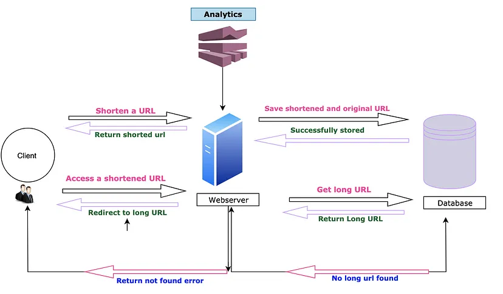

## Architecture

## Database Details

We will be using PostgreSQL for storing user and url details. Table Structure:

**Table: `users`**

| Column Name     | Data Type       | Description                                                   |
|-----------------|-----------------|---------------------------------------------------------------|
| `id`            | BIGINT (PK)     | Unique identifier for the user. Auto-Incremented.             |
| `email`         | VARCHAR(50)     | User's email address (unique).                                |
| `username`      | VARCHAR(50)     | Username chosen by the user.                                  |
| `password`      | VARCHAR(50)     | Hashed password for user authentication.                      |
| `created_at`    | TIMESTAMP       | Timestamp when the user account was created.                  |
| `updated_at`    | TIMESTAMP       | Timestamp when the user account was last updated.             |
| `is_active`     | BOOLEAN         | Flag indicating whether the user account is active.           |
| `role`          | VARCHAR(10)     | Role of the user, e.g., `admin`, `user`, etc.                 |

**Table: `shortened_urls`**

| Column Name       | Data Type       | Description                                                   |
|-------------------|-----------------|---------------------------------------------------------------|
| `id`              | BIGINT (PK)     | Unique identifier for each shortened URL.                     |
| `original_url`    | TEXT            | The original long URL that is being shortened.                |
| `shortened_code`  | VARCHAR(20)     | The unique code or key representing the shortened URL.        |
| `created_at`      | TIMESTAMP       | Timestamp when the shortened URL was created.                 |
| `updated_at`      | TIMESTAMP       | Timestamp when the shortened URL was last updated.            |
| `expiration_date` | TIMESTAMP       | (Optional) Timestamp when the shortened URL expires.          |
| `last_accessed`   | TIMESTAMP       | (Optional) Timestamp of the last access of the shortened URL. |
| `user_id`         | BIGINT (FK)     | Foreign key to the `users` table, linking the URL to a user.  |
| `is_active`       | BOOLEAN         | Flag indicating whether the shortened URL is active.          |
